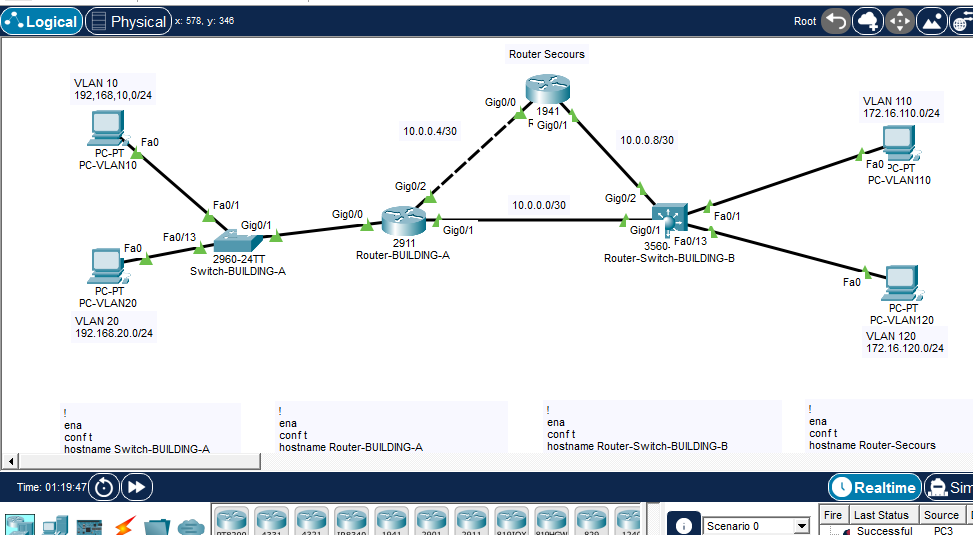
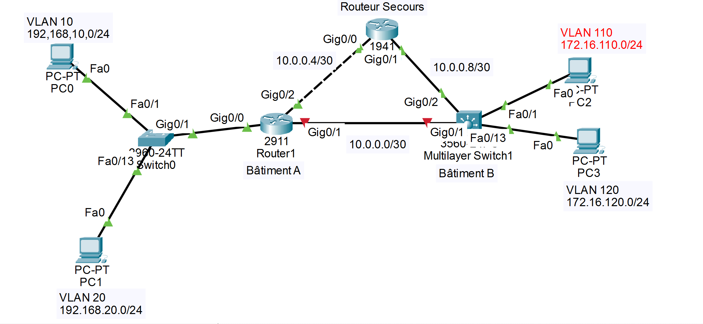
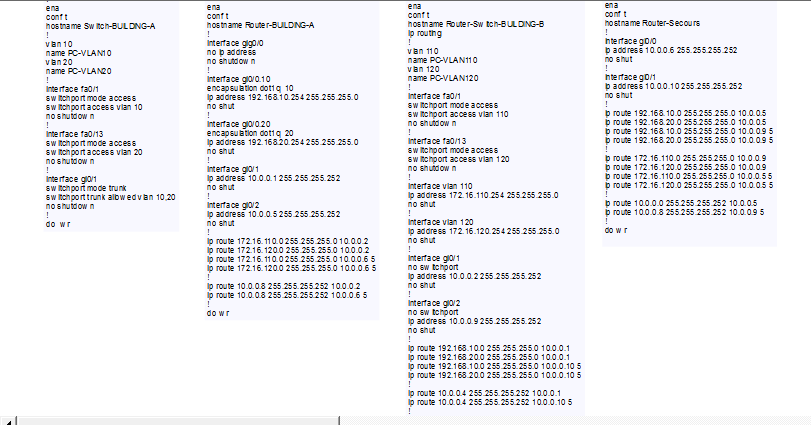

# Routage de secours par distance administrative

**Réseau redondant entre deux bâtiments à l'aide de routes statiques flottantes**

| Élément | Contenu |
|---|---|
| **Référent** | Conception et documentation d'un réseau redondant reliant deux bâtiments, où un routeur de secours prend automatiquement le relais grâce à la distance administrative. |
| **Émetteur** | **Abdul-Bariu.** |
| **Message** | Présenter et documenter la configuration complète d'une topologie en triangle assurant une connectivité continue malgré la panne du lien principal. |
| **Récepteur** | Le grand public — toute personne souhaitant comprendre ou reproduire une redondance réseau sans protocole de routage dynamique. |
| **Canal** | Un dépôt GitLab-Rosemont |
| **Code** | La langue française |
| **Référence** | Consultez le [guide Cisco sur le routage statique](https://www.cisco.com/c/en/us/support/docs/ip/routing-information-protocol-rip/13716-49.html) et la [documentation Cisco sur la distance administrative](https://www.cisco.com/c/en/us/support/docs/ip/border-gateway-protocol-bgp/15986-admin-distance.html). |

---

## 1. Objectif du projet

L'objectif est de construire un réseau où **chaque destination est joignable par deux chemins distincts**, et où le basculement de l'un vers l'autre se fait automatiquement, sans aucun protocole de routage dynamique.

Tout repose sur les **routes statiques et la distance administrative**. Une route principale est installée avec la distance par défaut de 1. Une seconde route vers la même destination est installée avec une distance de 5. Tant que le prochain saut principal est joignable, seule la route de distance 1 figure dans la table de routage. Dès que le lien principal tombe, cette route disparaît et la route de distance 5 — la *route flottante* — prend sa place.

Résultat concret : le poste `PC-VLAN10` joint `PC-VLAN110` que le lien direct entre les deux bâtiments soit debout ou non.

---

## 2. Topologie



Quatre équipements forment un triangle :

| Équipement | Modèle | Rôle |
|---|---|---|
| `Switch-BUILDING-A` | 2960-24TT | Commutateur d'accès de niveau 2, VLAN 10 et VLAN 20 |
| `Router-BUILDING-A` | 2911 | Routeur sur bâton, passerelle du bâtiment A |
| `Router-Switch-BUILDING-B` | 3560 | Commutateur multicouche, routage inter-VLAN du bâtiment B |
| `Router-Secours` | 1941 | Routeur de secours, troisième côté du triangle |

Le trait pointillé sur le schéma représente le chemin de secours. Il ne transporte aucun trafic en fonctionnement normal.

---

## 3. Plan d'adressage



### VLAN utilisateurs

| VLAN | Nom | Réseau | Passerelle | Emplacement |
|---|---|---|---|---|
| 10 | PC-VLAN10 | 192.168.10.0/24 | 192.168.10.254 | Bâtiment A |
| 20 | PC-VLAN20 | 192.168.20.0/24 | 192.168.20.254 | Bâtiment A |
| 110 | PC-VLAN110 | 172.16.110.0/24 | 172.16.110.254 | Bâtiment B |
| 120 | PC-VLAN120 | 172.16.120.0/24 | 172.16.120.254 | Bâtiment B |
| 666 | Trou-noir | — | — | VLAN poubelle pour les ports inutilisés |

### Liens de transit

| Réseau | Côté A | Côté B | Chemin |
|---|---|---|---|
| 10.0.0.0/30 | `Router-BUILDING-A` Gi0/1 — **10.0.0.1** | `Router-Switch-BUILDING-B` Gi0/1 — **10.0.0.2** | Principal |
| 10.0.0.4/30 | `Router-BUILDING-A` Gi0/2 — **10.0.0.5** | `Router-Secours` Gi0/0 — **10.0.0.6** | Secours |
| 10.0.0.8/30 | `Router-Secours` Gi0/1 — **10.0.0.10** | `Router-Switch-BUILDING-B` Gi0/2 — **10.0.0.9** | Secours |

Chaque `/30` offre exactement deux adresses utilisables, ce qui correspond précisément au besoin d'une liaison point à point.

---

## 4. Comment la distance administrative provoque le basculement

La distance administrative est le critère avec lequel IOS départage deux routes menant à la même destination. **Plus la valeur est basse, plus la route est jugée fiable.** Une route statique vaut 1 par défaut. Ajouter un chiffre à la fin de la commande `ip route` remplace cette valeur.

Sur `Router-BUILDING-A` :

```
ip route 172.16.110.0 255.255.255.0 10.0.0.2       ← distance 1, lien direct vers le bâtiment B
ip route 172.16.110.0 255.255.255.0 10.0.0.6 5     ← distance 5, via le routeur de secours
```

**En fonctionnement normal.** Les deux routes sont configurées, mais seule celle de distance 1 est installée. La commande `show ip route` n'affiche qu'une entrée :

```
S    172.16.110.0/24 [1/0] via 10.0.0.2
```

**Après la panne du lien principal.** L'interface Gi0/1 tombe, donc 10.0.0.2 devient injoignable. IOS retire la route de distance 1 et promeut la route flottante :

```
S    172.16.110.0/24 [5/0] via 10.0.0.6
```

Le trafic quitte désormais le bâtiment A vers `Router-Secours`, qui le transmet au bâtiment B par le réseau 10.0.0.8/30. Lorsque le lien principal revient, la route de distance 1 se réinstalle et la route de secours redevient dormante. Aucune intervention manuelle n'est nécessaire à aucun moment.

---

## 5. Les routes vers les réseaux de transit

C'est le point que la plupart des configurations oublient.

Le triangle comporte trois liaisons `/30`, mais **chaque équipement n'est physiquement raccordé qu'à deux d'entre elles**. La troisième lui est totalement inconnue :

- `Router-BUILDING-A` connaît 10.0.0.0/30 et 10.0.0.4/30, mais **ignore 10.0.0.8/30**
- `Router-Switch-BUILDING-B` connaît 10.0.0.0/30 et 10.0.0.8/30, mais **ignore 10.0.0.4/30**
- `Router-Secours` connaît 10.0.0.4/30 et 10.0.0.8/30, mais **ignore 10.0.0.0/30**

Sans route explicite vers le segment manquant, un ping depuis `PC-VLAN10` vers `10.0.0.9` échoue avec le message *Destination host unreachable*, et la sortie de `tracert` reste incomplète. La connectivité entre postes peut sembler correcte alors que le réseau n'est pas entièrement routé.

Chaque équipement reçoit donc une route principale et une route flottante vers le réseau de transit auquel il n'est pas raccordé :

```
! Sur Router-BUILDING-A
ip route 10.0.0.8 255.255.255.252 10.0.0.2
ip route 10.0.0.8 255.255.255.252 10.0.0.6 5
```

Attention au masque : `255.255.255.252`, et non `255.255.255.0`. IOS rejette un masque `/24` sur un réseau se terminant par `.4` avec l'erreur `%Inconsistent address and mask`.

---

## 6. Vue d'ensemble de la configuration



La configuration complète et testée de chaque équipement se trouve dans le dossier [`configs/`](configs/).

### Points à retenir

**Routeur sur bâton.** L'interface physique `Gi0/0` ne porte aucune adresse IP. Deux sous-interfaces marquées par `encapsulation dot1q 10` et `dot1q 20` servent de passerelles aux deux VLAN sur un seul lien physique.

**Ports routés sur le 3560.** Les ports d'un commutateur multicouche sont en niveau 2 par défaut. La commande `no switchport` doit être saisie **avant** `ip address`, sinon IOS refuse l'adresse et l'interface reste en mode commutation. Cette seule commande conditionne tout le routage du bâtiment B.

```
interface GigabitEthernet0/1
 no switchport
 ip address 10.0.0.2 255.255.255.252
```

En revanche, `no switchport` ne s'applique **pas** à une interface SVI comme `interface Vlan110` : une SVI est déjà une interface de niveau 3, et IOS renvoie `% Invalid input detected`.

**Routage global.** La commande `ip routing` doit être activée sur le 3560, faute de quoi il se comporte en simple commutateur de niveau 2 et aucune de ses routes statiques n'est utilisée.

**VLAN trou noir.** Tous les ports d'accès inutilisés sont affectés au VLAN 666 puis désactivés administrativement. Un port inutilisé laissé actif dans le VLAN 1 constitue une porte d'entrée ouverte sur le réseau.

---

## 7. Validation

### Chemin principal

Depuis `PC-VLAN10` :

```
ping 172.16.110.10
ping 172.16.120.10
ping 10.0.0.9
ping 10.0.0.10
```

Les quatre commandes doivent aboutir. Les deux dernières prouvent que les réseaux de transit sont entièrement routés.

Sur `Router-BUILDING-A` :

```
show ip route static
```

Résultat attendu — seules les routes de distance 1 sont installées :

```
S    172.16.110.0/24 [1/0] via 10.0.0.2
S    172.16.120.0/24 [1/0] via 10.0.0.2
S    10.0.0.8/30     [1/0] via 10.0.0.2
```

### Test de bascule

Supprimez le câble entre `Router-BUILDING-A` Gi0/1 et `Router-Switch-BUILDING-B` Gi0/1, patientez une dizaine de secondes, puis relancez :

```
show ip route static
```

Les trois routes doivent désormais afficher `[5/0] via 10.0.0.6`.

Depuis `PC-VLAN10` :

```
tracert 172.16.110.10
```

Le chemin doit passer par **10.0.0.6** puis **10.0.0.10**. Rebranchez le câble et vérifiez que les routes reviennent à `[1/0] via 10.0.0.2`.

---

## 8. Structure du dépôt

```
redundant-routing-lab/
├── README.md
├── images/
│   ├── topology.png
│   ├── addressing-plan.png
│   └── configuration-overview.png
└── configs/
    ├── Switch-BUILDING-A.txt
    ├── Router-BUILDING-A.txt
    ├── Router-Switch-BUILDING-B.txt
    └── Router-Secours.txt
```

---

## 9. Matériel

| Équipement | Modèle Cisco | IOS |
|---|---|---|
| Commutateur d'accès niveau 2 | Catalyst 2960-24TT | 15.0 |
| Routeur du bâtiment A | ISR 2911 | 15.1 |
| Commutateur niveau 3 | Catalyst 3560 | 12.2(37)SE1 |
| Routeur de secours | ISR 1941 | 15.1 |

Simulation réalisée sous **Cisco Packet Tracer**.